# UniFi Gate Opener

<div align="center">
  <h1>🚪 UniFi Gate Opener</h1>
  <p><strong>Enterprise-grade access control meets smart home simplicity</strong></p>
  
  <br><br>
  
  [](https://github.com/fbettag/unifi-gate-opener/actions)
  [](https://github.com/fbettag/unifi-gate-opener/releases)
  [](LICENSE)
  [](https://golang.org)
  [](https://github.com/fbettag/unifi-gate-opener/releases)
  
  <h3>Transform your UniFi network into an intelligent gate controller with reliable automation</h3>
</div>

## 🎯 Why UniFi Gate Opener?

**The Problem:** Traditional gate controllers are unpredictable and frustrating. My dad's Arduino-based system was inconsistent - sometimes working instantly, sometimes with long delays, and occasionally stopping the gate mid-way after manual triggering. Sound familiar?

**The Solution:** UniFi Gate Opener leverages your existing UniFi infrastructure to create a **considerably faster** and **noticeably more reliable** automated gate system. By monitoring device connections at the network level, we eliminate the unpredictability of traditional sensors.

**Born from Necessity:** After watching my dad deal with yet another unpredictable gate response, I knew there had to be a better way. Your UniFi access points already know when you arrive home - why not use that intelligence to control your gate reliably?

## ⚡ Quick Start

### 🚀 Automated Installation (Recommended)

```bash
# One-line installation with automatic service setup (Linux only)
curl -fsSL https://raw.githubusercontent.com/fbettag/unifi-gate-opener/main/install.sh | sudo bash
```

**What this does:**
- Auto-detects your Linux distribution and architecture (amd64, arm64, armv7)
- Downloads the latest release
- Sets up system user and directories with proper permissions
- Creates and enables service (systemd/init.d)
- Prompts for configuration port
- **Ready to use in under 2 minutes!**

### 📱 Manual Installation

```bash
# Download for your architecture:
# Linux AMD64
wget https://github.com/fbettag/unifi-gate-opener/releases/latest/download/unifi-gate-opener-v0.1.0-linux-amd64.tar.gz
tar -xzf unifi-gate-opener-v0.1.0-linux-amd64.tar.gz
./unifi-gate-opener-linux-amd64

# Linux ARM64 (e.g., newer Raspberry Pi)
wget https://github.com/fbettag/unifi-gate-opener/releases/latest/download/unifi-gate-opener-v0.1.0-linux-arm64.tar.gz

# Linux ARMv7 (e.g., Raspberry Pi 2/3)
wget https://github.com/fbettag/unifi-gate-opener/releases/latest/download/unifi-gate-opener-v0.1.0-linux-arm.tar.gz
```

### 🎯 Setup Steps

1. Open your browser to `http://localhost:8080`
2. Complete the **Setup Wizard**:
   - Create your admin account (username & password)
   - Enter UniFi Controller details (URL, credentials)
   - Select your UniFi site
   - Choose the access point closest to your gate
3. From the dashboard, click **"Add Device"**
4. Select devices from the dropdown of connected UniFi clients
5. **Done!** Your gate now opens automatically

<details>
<summary>🐳 Prefer Docker?</summary>

```bash
# Build locally (Docker images not yet published to registry)
git clone https://github.com/fbettag/unifi-gate-opener.git
cd unifi-gate-opener
docker build -t unifi-gate-opener .

# Run the locally built image
docker run -d \
  --name unifi-gate-opener \
  -p 8080:8080 \
  -v /opt/gate-opener:/app/data \
  --restart unless-stopped \
  unifi-gate-opener:latest
```

**Note**: Pre-built Docker images will be available once the container registry is enabled.
</details>

## 🚀 Key Features

### Fast & Reliable Detection
- **Considerably faster** than traditional sensors
- **Noticeably more reliable** operation
- Real-time UniFi API polling (configurable 1-60 seconds)
- Smart connection duration logic prevents false triggers

### Enterprise-Grade Reliability  
- Automatic reconnection on network interruptions
- Works with self-signed UniFi certificates
- SQLite database survives power outages
- No cloud dependencies - 100% local

### Intelligent Automation
- **Direction detection** - knows if you're arriving or leaving
- **Cooldown protection** - prevents rapid triggering
- **Guest mode** - manual override for visitors
- **Multi-device support** - family members, multiple cars

### Professional Security
- Bcrypt password hashing
- Session-based authentication
- MAC address validation
- Activity logging with audit trail

### Beautiful Management Interface
- Modern dark mode dashboard
- Real-time device monitoring
- Searchable UniFi client dropdown
- One-click device management

## 📸 Screenshots

<div align="center">
  <table>
    <tr>
      <td align="center">
        
        <br><em>Real-time Dashboard</em>
      </td>
      <td align="center">
        
        <br><em>Device Management</em>
      </td>
    </tr>
    <tr>
      <td align="center">
        
        <br><em>Easy Device Selection</em>
      </td>
      <td align="center">
        
        <br><em>Activity History</em>
      </td>
    </tr>
    <tr>
      <td align="center" colspan="2">
        
        <br><em>Configuration Settings</em>
      </td>
    </tr>
  </table>
</div>

## 🏗️ Architecture

```mermaid
graph TB
    subgraph "Your Devices"
        Phone[📱 Phone]
        Car[🚗 Car WiFi]
        Watch[⌚ Smart Watch]
    end
    
    subgraph "UniFi Network"
        AP[📡 Access Point]
        Controller[🎛️ UniFi Controller]
    end
    
    subgraph "UniFi Gate Opener"
        Monitor[👁️ Device Monitor]
        Logic[🧠 Decision Logic]
        API[🌐 Web Interface]
        DB[(📊 SQLite DB)]
    end
    
    subgraph "Gate System"
        Shelly[🔌 Shelly Relay]
        Gate[🚪 Gate Motor]
    end
    
    Phone --> AP
    Car --> AP
    Watch --> AP
    AP --> Controller
    Controller -->|API| Monitor
    Monitor --> Logic
    Logic -->|Log| DB
    Logic -->|Trigger| Shelly
    Shelly -->|Control| Gate
    API -->|Manage| Logic
    API -->|View| DB
```



UniFi Gate Opener acts as an intelligent bridge between your UniFi network and gate controller:

1. **Monitors** UniFi controller for device connections
2. **Detects** when authorized devices connect to gate AP
3. **Triggers** Shelly relay or compatible HTTP endpoint
4. **Logs** all activity for security and troubleshooting

## 🛠️ Installation

### System Requirements
- UniFi Controller (self-hosted or Dream Machine)
- Shelly relay or HTTP-triggered gate controller
- Linux host (SQLite with CGO requirement)
- 50MB RAM, minimal CPU
- Supported architectures: amd64, arm64, armv7 (Raspberry Pi 2+)

### Installation Methods

<details open>
<summary>🚀 Automated Installation (Recommended)</summary>

**One-command setup for Linux systems:**

```bash
curl -fsSL https://raw.githubusercontent.com/fbettag/unifi-gate-opener/main/install.sh | sudo bash
```

**Features:**
- **Auto-detection**: Linux distribution, architecture, and service management system
- **Complete setup**: Binary, user, directories, permissions, service files
- **Smart service setup**: systemd or init.d as appropriate
- **Interactive configuration**: Prompts for port selection
- **Production ready**: Follows FHS standards (`/opt`, `/etc`, `/var`)

**Supported platforms:**
- **Linux distributions**: Ubuntu, Debian, CentOS, RHEL, Alpine, Arch, Raspbian
- **Service managers**: systemd, init.d
- **Architectures**: 
  - AMD64 (x86_64)
  - ARM64 (aarch64) - Raspberry Pi 4, newer SBCs
  - ARMv7 (armhf) - Raspberry Pi 2/3, older SBCs

**Post-installation:**
- Service runs automatically on boot
- Configuration: `/etc/unifi-gate-opener/config.yaml`
- Database: `/var/lib/unifi-gate-opener/gate_opener.db`
- Logs: `/var/log/unifi-gate-opener/`
- Manage with: `systemctl` (systemd) or `service` (init.d) commands

</details>

<details>
<summary>📦 Manual Binary Installation</summary>

```bash
# Linux AMD64 (x86_64)
wget https://github.com/fbettag/unifi-gate-opener/releases/latest/download/unifi-gate-opener-linux-amd64.tar.gz
tar -xzf unifi-gate-opener-linux-amd64.tar.gz
chmod +x unifi-gate-opener-linux-amd64
sudo mv unifi-gate-opener-linux-amd64 /usr/local/bin/unifi-gate-opener

# Linux ARM64 (Raspberry Pi 4, newer SBCs)
wget https://github.com/fbettag/unifi-gate-opener/releases/latest/download/unifi-gate-opener-linux-arm64.tar.gz
tar -xzf unifi-gate-opener-linux-arm64.tar.gz
chmod +x unifi-gate-opener-linux-arm64
sudo mv unifi-gate-opener-linux-arm64 /usr/local/bin/unifi-gate-opener

# Linux ARMv7 (Raspberry Pi 2/3)
wget https://github.com/fbettag/unifi-gate-opener/releases/latest/download/unifi-gate-opener-linux-arm.tar.gz
tar -xzf unifi-gate-opener-linux-arm.tar.gz
chmod +x unifi-gate-opener-linux-arm
sudo mv unifi-gate-opener-linux-arm /usr/local/bin/unifi-gate-opener

# Run
unifi-gate-opener
```
</details>

<details>
<summary>🏗️ Build from Source</summary>

```bash
# Clone repository
git clone https://github.com/fbettag/unifi-gate-opener.git
cd unifi-gate-opener

# Build
make build

# Install system-wide
sudo make install

# Run
unifi-gate-opener
```
</details>

<details>
<summary>🐧 Manual Systemd Service</summary>

*Note: The automated installer handles this automatically*

```bash
# Create service file
sudo tee /etc/systemd/system/unifi-gate-opener.service > /dev/null <<EOF
[Unit]
Description=UniFi Gate Opener
After=network.target

[Service]
Type=simple
User=unifi-gate-opener
Group=unifi-gate-opener
ExecStart=/opt/unifi-gate-opener/unifi-gate-opener \\
  --config=/etc/unifi-gate-opener/config.yaml \\
  --database=/var/lib/unifi-gate-opener/gate_opener.db \\
  --port=8080 \\
  --daemon
Restart=always
RestartSec=5
NoNewPrivileges=true
ProtectSystem=strict
ReadWritePaths=/var/lib/unifi-gate-opener /var/log/unifi-gate-opener

[Install]
WantedBy=multi-user.target
EOF

# Enable and start
sudo systemctl enable unifi-gate-opener
sudo systemctl start unifi-gate-opener
```
</details>

<details>
<summary>🏠 Home Assistant Add-on</summary>

Coming soon! Track progress in [issue #23](https://github.com/fbettag/unifi-gate-opener/issues/23)
</details>

## ⚙️ Configuration

### Setup Wizard Flow
1. **Admin Account** - Create username and secure password
2. **UniFi Controller** - Enter URL and credentials
3. **Site Selection** - Choose from available UniFi sites
4. **Gate Access Point** - Select AP from discovered list
5. **Dashboard** - Add devices from connected clients dropdown

### UniFi Controller Setup
- Create a read-only user for the gate opener
- Note your site ID (usually "default")
- Ensure API access is enabled

### Shelly Relay Configuration
```yaml
# Example Shelly 1 URL format:
http://192.168.1.100/relay/0?turn=on&timer=10

# Shelly Plus 1:
http://192.168.1.100/rpc/Switch.Set?id=0&on=true&timer_duration=10
```

### Advanced Options

<details>
<summary>📝 Configuration File</summary>

```yaml
admin:
  username: admin
  password_hash: $2a$10$...

unifi:
  controller_url: https://192.168.1.1:8443
  username: gatekeeper
  password: secure-password
  site_id: default
  gate_ap_mac: "aa:bb:cc:dd:ee:ff"
  poll_interval: 1

shelly:
  trigger_url: http://192.168.1.100/relay/0?turn=on&timer=10

gate:
  open_duration: 10  # minutes
  log_activity: true

devices:
  - mac: "11:22:33:44:55:66"
    name: "Dad's iPhone"
    enabled: true
```
</details>

## 🔧 API Reference

RESTful API for integration with Home Assistant, Node-RED, or custom systems:

```bash
# Get system status
curl http://localhost:8080/api/status

# List devices
curl http://localhost:8080/api/devices

# Manually trigger gate
curl -X POST http://localhost:8080/api/test-gate

# Add new device
curl -X POST http://localhost:8080/api/devices \
  -H "Content-Type: application/json" \
  -d '{"mac":"aa:bb:cc:dd:ee:ff","name":"New Device"}'
```

[Full API Documentation →](https://github.com/fbettag/unifi-gate-opener/wiki/API-Reference)

## 🚨 Troubleshooting

<details>
<summary>Gate not opening?</summary>

1. Test manual trigger from dashboard
2. Verify device MAC in UniFi controller
3. Check cooldown timer hasn't activated
4. Ensure device connects to correct AP
5. Review activity logs for errors
</details>

<details>
<summary>Can't connect to UniFi?</summary>

1. Verify controller URL includes https://
2. Check username has API access
3. Test connectivity: `curl -k https://your-controller:8443`
4. Review logs: `./unifi-gate-opener --log-level=debug`
</details>

## 🤝 Community & Support

- 💬 [Discussions](https://github.com/fbettag/unifi-gate-opener/discussions) - Get help, share setups
- 🐛 [Issue Tracker](https://github.com/fbettag/unifi-gate-opener/issues) - Report bugs
- 💡 [Feature Requests](https://github.com/fbettag/unifi-gate-opener/issues/new?labels=enhancement) - Suggest improvements
- 📧 [Security](mailto:security@fbettag.com) - Report vulnerabilities

### Success Stories

> "Replaced my unpredictable Arduino setup - now the gate opens reliably every time!" - *Michael R.*

> "The direction detection is brilliant. No more gate opening when I'm just walking the dog." - *Sarah T.*

> "Rock solid for 6 months. Even survived a power outage with zero config loss." - *James M.*

## 🗺️ Roadmap

- [ ] Home Assistant native add-on
- [ ] UniFi Access integration
- [ ] Multiple gate support
- [ ] Geofencing enhancement
- [ ] iOS/Android companion apps
- [ ] MQTT support
- [ ] Webhook notifications

## 🏆 Comparison

| Feature | UniFi Gate Opener | Traditional Systems | DIY Arduino |
|---------|-------------------|---------------------|-------------|
| Detection Speed | Considerably faster | Baseline | Inconsistent |
| Reliability | Noticeably more reliable | Variable | Unpredictable |
| Weather Resistant | ✅ (network-based) | ❌ | Variable |
| Setup Time | 10 minutes | 2-4 hours | 4-8 hours |
| Maintenance | None | Monthly | Frequent |
| Cost | Free* | $200-500 | $50-150 |

*Requires existing UniFi infrastructure

## 📝 License

BSD 3-Clause License - see [LICENSE](LICENSE) file for details.

## 🙏 Acknowledgments

Built with ❤️ for my dad and the countless others struggling with unreliable gate systems.

Special thanks to:
- The UniFi community for API documentation
- Shelly team for reliable, open hardware
- Contributors who've helped improve this project

---

<div align="center">
  <strong>Ready to modernize your gate?</strong><br>
  Star ⭐ this repo and transform your entrance today!
  
  <br><br>
  
  <a href="https://github.com/fbettag/unifi-gate-opener/releases/latest">
    
  </a>
</div>